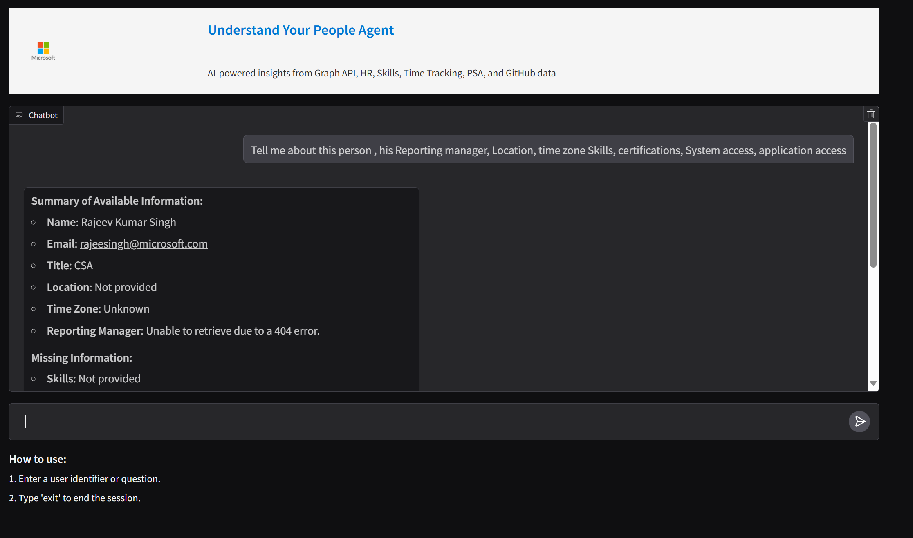

# PeopleAgent_v3

##  Summary of UI page:
The UI page is built with Gradio and serves as a chatbot interface for interacting with PeopleAgent. It provides the following features:

###### Custom Chat Interface: 
Uses Gradio Blocks for a rich UI with a header (including a logo), chat history, and instruction panels.
###### Session Management: 
Supports creating and switching user sessions. New user inputs (like email identifiers) initialize sessions, while commands like "exit" clear the conversation.
###### Streaming Responses: 
Integrates streaming response handling by iterating over response chunks from PeopleAgent to update the UI in real time.
###### Logging: 
Provides detailed logging (including timing details) for every significant event (agent creation, response chunks, and memory clearance), which is useful for debugging.

## Why FastAPI is Needed for Deployment to App Service?

###### HTTP Server Capabilities: 
FastAPI acts as the backend server, exposing the UI as an HTTP endpoint. This makes it possible to deploy the app as a web service.
###### ASGI Support: 
By mounting the Gradio UI onto a FastAPI app, the package leverages ASGI (Asynchronous Server Gateway Interface) for efficient handling of asynchronous tasks, which is essential for streaming responses.

###### Integration with App Service: 
FastAPI applications are well-suited for Azure App Service and other cloud platforms. They run efficiently in production environments, ensuring that the app can scale and handle concurrent user sessions.

##### Deployment Package Detail:

Uvicorn: Acts as the ASGI server that runs the FastAPI application. This package is specifically used for hosting asynchronous web applications and is a common choice for deploying FastAPI projects.

The combination of Gradio for the interactive UI and FastAPI (powered by uvicorn) for the backend provides an easily deployable solution on App Service.

## Deployment Steps:

1. Create an Azure App Service resource and deploy the app from VScode to App Service
2. Go to Settings -> Environment variables -> Add the ENV variables  
3. Go to Deployment -> Settings -> configuration and add the below command in the start up command:
uvicorn PeopleAgentv3.UI.UI_v3:app --host 0.0.0.0 --port $PORT

## Sample Screenshot

